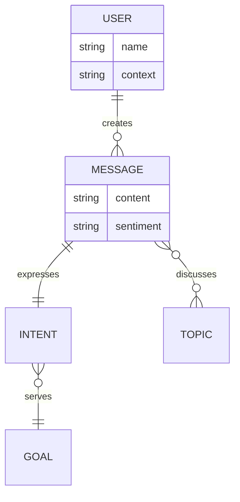

# ElizaOS Worldview Plugin

An ElizaOS plugin that provides agents with evolving ontological worldviews. Agents continuously learn and refine their understanding of entities and relationships through interaction, creating a semantic scaffolding for interpretation.

## Version Compatibility

- **v0.2.0+**: Compatible with ElizaOS 1.7.0+ (`@elizaos/core`)
- **v0.1.0**: Compatible with ElizaOS 0.1.x (`@ai16z/eliza`)

## Features

- **Continuous Evolution**: Automatically detects patterns in conversations and evolves the ontology
- **Mermaid ER Diagrams**: Human-readable, git-diffable ontology storage
- **Semantic Cardinality**: Relationship cardinality carries semantic meaning for reasoning
- **Auto-Learning**: High-confidence patterns are automatically integrated
- **Suggestion Queue**: Medium-confidence patterns queued for review
- **Lightweight**: Minimal overhead, runs in background

## Installation

```bash
npm install @eliza/plugin-worldview
# or
bun add @eliza/plugin-worldview
```

## Quick Start

```typescript
import { createWorldviewPlugin } from '@eliza/plugin-worldview'
import { type Character } from '@elizaos/core'

// In your character definition
export const character: Character = {
  name: "MyAgent",
  plugins: [
    "@elizaos/plugin-bootstrap",
    "@elizaos/plugin-sql",
    // Add worldview plugin with configuration
    createWorldviewPlugin({
      evolutionIntervalMs: 60000,    // Check for patterns every minute
      autoApplyThreshold: 0.9,        // Auto-apply suggestions with >90% confidence
      minObservations: 3,             // Require 3+ co-occurrences for patterns
      memoryLookback: 50              // Analyze last 50 memories
    }) as any, // TypeScript workaround - Plugin objects are supported at runtime
  ],
  // ... rest of character config
}
```

## How It Works

### 1. Pattern Detection
The plugin continuously analyzes recent memories to detect:
- Entity co-occurrences
- Relationship patterns
- Cardinality inference from frequency

### 2. Suggestion Generation
Patterns generate suggestions with confidence scores:
- **>0.9**: Auto-applied to ontology
- **0.7-0.9**: Queued for review
- **<0.7**: Ignored

### 3. Ontology Evolution
The worldview evolves as:
```
Interactions → Memories → Pattern Detection → Suggestions → Ontology Updates
```

## Ontology Structure

### Entities
```typescript
{
  id: string              // Unique identifier
  type: string            // Entity type
  attributes: {}          // Custom attributes
  firstSeen: Date         // When first observed
  lastSeen: Date          // Most recent observation
  observationCount: number // Total observations
}
```

### Relationships
```typescript
{
  id: string              // Unique identifier
  type: string            // Relationship type
  source: string          // Source entity ID
  target: string          // Target entity ID
  cardinality: Cardinality // Semantic cardinality
  confidence: number      // Confidence score (0-1)
  observations: number    // Times observed
  metadata: {}            // Custom metadata
}
```

## Cardinality Semantics

Cardinality carries semantic meaning for reasoning:

| Cardinality | Symbol | Meaning | Example |
|-------------|--------|---------|---------|
| OneToOne | `\|\|--\|\|` | Equivalence, identity | USER \|\|--\|\| PROFILE |
| OneToMany | `\|\|--o{` | Composition, ownership | USER \|\|--o{ MESSAGE |
| ManyToOne | `}o--\|\|` | Attribution, categorization | MESSAGE }o--\|\| TOPIC |
| ManyToMany | `}o--o{` | Association | MESSAGE }o--o{ TAG |

### Semantic Implications

```typescript
// OneToMany implies ownership
USER ||--o{ GOAL
→ "Users have multiple goals, goals belong to users"
→ If user context ends, their goals become less relevant

// ManyToMany implies association
MESSAGE }o--o{ TOPIC
→ "Messages can cover many topics, topics appear in many messages"
→ No ownership, pure association

// OneToOne implies equivalence
ACTION ||--|| INTENT
→ "Each action expresses exactly one intent"
→ Strong semantic binding
```

## Mermaid Storage Format

Worldviews are stored as Mermaid ER diagrams in `runtime/worldviews/{agentId}.mermaid`:



## API Reference

### Graph Methods

```typescript
// Get the worldview graph (from plugin state)
const state = pluginState.get(runtime.agentId)
const graph = state?.graph

// Query entities
const users = graph.query({ type: 'USER' })

// Get entity
const entity = graph.getEntity('USER')

// Get relationships
const rels = graph.getRelationships('USER')

// Check relationship exists
const exists = graph.hasRelationship('USER', 'MESSAGE', 'creates')

// Get statistics
const stats = graph.getStats()
// { entities: 5, relationships: 8, avgConnections: 1.6 }

// Render as Mermaid
const diagram = graph.toMermaid()
```

## Registered Actions

The plugin registers these actions with the runtime:

### GET_WORLDVIEW
Get the current worldview as a Mermaid diagram:
- **Name**: `GET_WORLDVIEW`
- **Similes**: `SHOW_WORLDVIEW`, `VIEW_WORLDVIEW`
- **Returns**: Mermaid diagram and statistics

### QUERY_WORLDVIEW
Query entities in the worldview:
- **Name**: `QUERY_WORLDVIEW`  
- **Similes**: `SEARCH_WORLDVIEW`, `FIND_ENTITIES`
- **Usage**: Include "entity: TYPE" in message text
- **Returns**: Matching entities

### GET_SUGGESTIONS
Get pending worldview suggestions:
- **Name**: `GET_SUGGESTIONS`
- **Similes**: `SHOW_SUGGESTIONS`, `VIEW_SUGGESTIONS`
- **Returns**: Queue of pending suggestions with confidence scores

## Configuration

```typescript
interface WorldviewConfig {
  // How often to check for patterns (default: 60000ms)
  evolutionIntervalMs?: number

  // Auto-apply suggestions above this confidence (default: 0.9)
  autoApplyThreshold?: number

  // Minimum co-occurrences for pattern detection (default: 3)
  minObservations?: number

  // How many recent memories to analyze (default: 50)
  memoryLookback?: number
}
```

## Advanced Usage

### Custom Pattern Detection

```typescript
import { PatternObserver } from '@eliza/plugin-worldview'

const observer = new PatternObserver(graph)

// Adjust thresholds
observer.setThresholds(
  5,    // minObservations
  0.95, // highConfidenceThreshold
  0.8   // mediumConfidenceThreshold
)

// Analyze specific memories
const suggestions = observer.analyze(memories)
```

### Manual Ontology Management

```typescript
// Access graph through plugin state
const state = pluginState.get(runtime.agentId)
const graph = state.graph

// Add entity
graph.addEntity({
  id: 'WORKFLOW',
  type: 'WORKFLOW',
  attributes: { priority: 'high' },
  firstSeen: new Date(),
  lastSeen: new Date(),
  observationCount: 1
})

// Add relationship
graph.addRelationship({
  id: 'USER_owns_WORKFLOW',
  type: 'owns',
  source: 'USER',
  target: 'WORKFLOW',
  cardinality: Cardinality.OneToMany,
  confidence: 1.0,
  observations: 1,
  metadata: { manual: true }
})

// Save changes
await graph.save()
```

### Visualizing Evolution

Since worldviews are stored as Mermaid files, you can:

1. **View in any Mermaid renderer**
2. **Track changes with git**
3. **Generate diagrams in CI/CD**
4. **Render in documentation**

```bash
# View worldview
cat runtime/worldviews/agent-123.mermaid

# Track evolution
git log runtime/worldviews/agent-123.mermaid

# Generate diagram
mmdc -i runtime/worldviews/agent-123.mermaid -o worldview.png
```

## Architecture Notes (ElizaOS 1.7.2)

This plugin uses the ElizaOS 1.7.2 Service architecture:

- **Service Class**: Extends `Service` base class with both instance and static methods
- **State Management**: Uses global `pluginState` Map indexed by `agentId`
- **Memory Access**: Uses `runtime.getMemories()` with required `tableName` parameter
- **Logger**: Uses string-based logging format compatible with ElizaOS logger

## Environment Variables

```bash
# Directory for worldview storage (default: runtime/worldviews)
WORLDVIEW_DIR=./my-worldviews
```

## Examples

### Startup Log
```
[Worldview] Service starting...
[Worldview] Loaded worldview - entities: 12, relationships: 18, avgConnections: 1.50
[Worldview] Started evolution loop - intervalMs: 60000
[Worldview] Service started successfully
```

### Evolution Log
```
[Worldview] Generated suggestions - count: 3, highConfidence: 1
[Worldview] Auto-applied suggestion - type: new_relationship, confidence: 0.92, preview: USER ||--o{ PREFERENCE : has
[Worldview] Evolution complete - applied: 1, queued: 2, entities: 13, relationships: 19
```

## Migration from v0.1.0

If upgrading from v0.1.0 (ElizaOS 0.1.x):

1. Update peer dependency: `@ai16z/eliza` → `@elizaos/core`
2. Import paths remain the same
3. Plugin initialization remains the same
4. Existing worldview files are compatible

## Future Extensions

The lightweight ER foundation can evolve into more formal ontologies:

1. **Phase 1** (Current): Basic ER graph with CRUD operations
2. **Phase 2**: Inference rules (transitive relationships)
3. **Phase 3**: Conflict detection and resolution
4. **Phase 4**: Export to OWL/RDF for formal reasoning

## Contributing

Contributions welcome! This is a foundational implementation designed to evolve with the community.

## License

MIT
