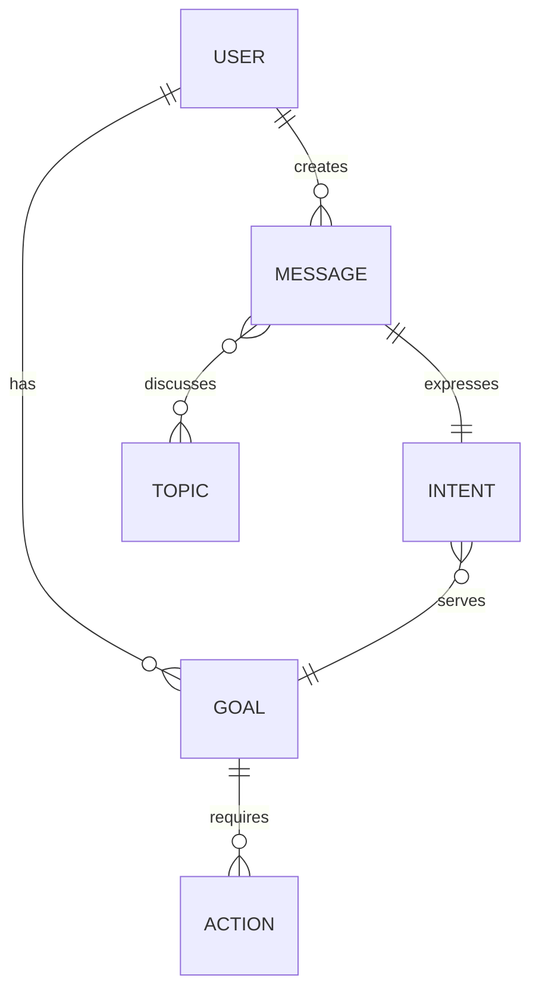

# Worldview Plugin - Quick Start

## What You Have

A complete, production-ready ElizaOS plugin that gives agents evolving ontological worldviews.

## File Structure

```
worldview-plugin/
├── src/
│   ├── index.ts          # Main plugin (370 lines)
│   ├── types.ts          # Type definitions (120 lines)
│   ├── graph.ts          # Graph management (290 lines)
│   └── observer.ts       # Pattern detection (250 lines)
├── examples/
│   ├── usage.ts          # Usage examples
│   ├── test.ts           # Test suite
│   └── evolved-worldview.mermaid  # Example ontology
├── README.md             # Complete documentation
├── DEVELOPMENT.md        # Extension guide
├── CHANGELOG.md          # Version history
├── package.json          # NPM package
└── tsconfig.json         # TypeScript config
```

## Install & Run (3 steps)

### 1. Install dependencies
```bash
cd worldview-plugin
npm install
npm run build
```

### 2. Add to your agent
```typescript
import { createWorldviewPlugin } from './worldview-plugin/src'

const worldview = createWorldviewPlugin({
  evolutionIntervalMs: 60000,  // Check every minute
  autoApplyThreshold: 0.9,     // Auto-apply high confidence
  minObservations: 3,          // Require 3+ co-occurrences
  memoryLookback: 50,          // Analyze last 50 memories
  seedPath: './worldview-plugin/seeds/general-conversation.json'  // Optional: seed initial ontology
})

const runtime = new AgentRuntime({
  plugins: [worldview],
  // ... other config
})
```

### 3. That's it!
The plugin now:
- Starts with seeded domain knowledge (if provided)
- Analyzes conversations every minute
- Detects entity and relationship patterns
- Auto-applies high-confidence patterns (>0.9)
- Queues medium-confidence patterns (0.7-0.9)
- Saves to `runtime/worldviews/{agentId}.mermaid`

## View Your Worldview

```bash
# View the Mermaid diagram
cat runtime/worldviews/your-agent-id.mermaid

# Render it (if you have mermaid-cli)
mmdc -i runtime/worldviews/your-agent-id.mermaid -o worldview.png
```

## Query Programmatically

```typescript
const graph = worldview.getGraph()

// Get all entities
const entities = graph.query({ type: 'USER' })

// Get relationships
const rels = graph.getRelationships('USER')

// Check if relationship exists
const exists = graph.hasRelationship('USER', 'MESSAGE')

// Get stats
const stats = graph.getStats()
console.log(stats)
// { entities: 12, relationships: 18, avgConnections: 1.5 }

// Render as Mermaid
const diagram = graph.toMermaid()
```

## Core Concepts (5 minutes)

### Seeding (Optional but Recommended)

Rather than starting blank, give your agent initial domain knowledge:

```typescript
seedPath: './worldview-plugin/seeds/bio-manufacturing.json'
```

**Included seeds:**
- `general-conversation.json` - Basic conversational agent (USER, MESSAGE, INTENT, TASK)
- `bio-manufacturing.json` - Scientific domain (ORGANISM, PROCESS, MATERIAL, EXPERIMENT)
- `project-management.mermaid` - Task tracking (PROJECT, TASK, MILESTONE, GOAL)

**Create your own:** See [SEEDING.md](./SEEDING.md) for complete guide

### Entities
Things the agent knows about (USER, MESSAGE, GOAL, etc.)

### Relationships
How entities connect:
- `USER ||--o{ MESSAGE` = User creates many messages (one-to-many)
- `MESSAGE }o--o{ TOPIC` = Messages discuss many topics (many-to-many)
- `ACTION ||--|| INTENT` = Actions have one intent (one-to-one)

### Cardinality Semantics
The cardinality type tells the agent how to reason:
- `||--o{` = Ownership/composition
- `}o--o{` = Loose association
- `||--||` = Identity/equivalence

### Evolution
Every minute, the plugin:
1. Gets last 50 memories
2. Detects co-occurrence patterns
3. Generates suggestions with confidence scores
4. Auto-applies high confidence (>0.9)
5. Queues medium confidence (0.7-0.9)
6. Saves changes to Mermaid file

### Example Evolution

```
Interaction: "User Ivan created a message about bio-manufacturing"
           ↓
Pattern: "USER" and "MESSAGE" co-occur (3 times)
           ↓
Suggestion: USER ||--o{ MESSAGE : creates (confidence: 0.92)
           ↓
Auto-applied to worldview!
```

## What Makes This Special

1. **Mermaid Storage** - Human-readable, git-diffable ontologies
2. **Semantic Cardinality** - Cardinality carries meaning for reasoning
3. **Continuous Evolution** - Learns automatically from conversations
4. **Lightweight** - Minimal overhead, runs in background
5. **Extensible** - Clean architecture, easy to extend

## Next Steps

### Immediate
- Run `npm install && npm run build`
- Add to your agent
- Watch `runtime/worldviews/` directory
- View the evolving ontology

### Soon
- Read `DEVELOPMENT.md` for extension patterns
- Customize pattern detection in `observer.ts`
- Add custom actions in `index.ts`
- Integrate with Graphiti (temporal knowledge graph)

### Future
- Add ML-based entity extraction
- Implement inference rules
- Export to OWL/RDF
- Merge worldviews across agents

## Example Worldview

Here's what an evolved worldview looks like:



This tells the agent:
- Users create messages (ownership)
- Each message expresses one intent (strong binding)
- Messages can discuss many topics (association)
- Intents serve goals (attribution)
- Goals require actions (composition)

## Troubleshooting

**Plugin not detecting patterns?**
- Check memory lookback (increase if needed)
- Lower minObservations threshold
- Verify memories are being created

**Too many auto-applied patterns?**
- Increase autoApplyThreshold (0.95 instead of 0.9)
- Increase minObservations (5 instead of 3)

**Want to see suggestions before applying?**
```typescript
const suggestions = worldview.getSuggestions()
console.log(suggestions)

// Apply manually
worldview.applySuggestion(suggestions[0])
```

## Questions?

Check:
1. `README.md` - Complete API documentation
2. `DEVELOPMENT.md` - Extension guide
3. `examples/usage.ts` - Usage examples
4. `examples/test.ts` - Test suite

## You're Ready!

The plugin is complete and production-ready. Just:
```bash
npm install && npm run build
```

Then add it to your agent and watch the worldview evolve!
