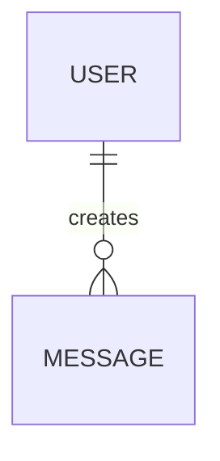

# Worldview Seeding - Quick Reference

## One-Liner Setup

```typescript
createWorldviewPlugin({ seedPath: './seeds/bio-manufacturing.json' })
```

## Included Seeds

| Seed | Domain | Entities | Use For |
|------|--------|----------|---------|
| `general-conversation.json` | General | 8 | Chatbots, assistants |
| `bio-manufacturing.json` | Scientific | 16 | Lab automation, research |
| `project-management.mermaid` | Productivity | 7 | Task tracking, workflows |
| `game-design.json` | Interactive | 11 | NPCs, storytelling |

## Formats

### JSON
```json
{
  "entities": [{"id": "USER", "type": "USER"}],
  "relationships": [{
    "source": "USER",
    "target": "MESSAGE",
    "type": "creates",
    "cardinality": "||--o{",
    "confidence": 1.0
  }]
}
```

### Mermaid


## Cardinality Cheatsheet

| Symbol | Meaning | Use When |
|--------|---------|----------|
| `\|\|--o{` | OneToMany | Ownership (USER owns MESSAGEs) |
| `}o--o{` | ManyToMany | Association (MESSAGE discusses TOPICs) |
| `\|\|--\|\|` | OneToOne | Identity (ACTION has one INTENT) |
| `}o--\|\|` | ManyToOne | Attribution (MESSAGEs in CONVERSATION) |

## Seed Behavior

✓ Loaded only on **first run**  
✓ Existing worldviews take **precedence**  
✓ Agent **evolves** seeded concepts  
✓ To reseed: delete `runtime/worldviews/{agentId}.mermaid`

## Custom Seed Template

```json
{
  "entities": [
    {"id": "MY_ENTITY", "type": "MY_ENTITY", "attributes": {}}
  ],
  "relationships": [
    {
      "source": "MY_ENTITY",
      "target": "OTHER_ENTITY",
      "type": "relates_to",
      "cardinality": "||--o{",
      "confidence": 1.0
    }
  ]
}
```

## Common Patterns

**User-centric:** USER → MESSAGE → INTENT → GOAL  
**Process-oriented:** INPUT → PROCESS → OUTPUT  
**Hierarchical:** PARENT ||--o{ CHILD  
**Network:** NODE }o--o{ NODE

## Where to Put Seeds

```
your-project/
└── packages/plugin-worldview/
    └── seeds/
        ├── your-domain.json         ← Custom seeds here
        ├── general-conversation.json
        └── bio-manufacturing.json
```

## Integration Examples

### Basic
```typescript
seedPath: './seeds/general-conversation.json'
```

### Character File
```json
{
  "plugins": {
    "worldview": {
      "seedPath": "./seeds/bio-manufacturing.json"
    }
  }
}
```

### Environment Variable
```bash
WORLDVIEW_SEED_PATH=./seeds/custom.json
```

## Pro Tips

💡 Start with 5-10 core entities  
💡 Focus on structural relationships  
💡 Let evolution handle associations  
💡 Use high confidence (1.0) for seeds  
💡 Share seeds across multi-agent systems

## Full Documentation

- Complete guide: `SEEDING.md`
- Examples: `examples/seeded-agents.ts`
- Your seeds: `seeds/`

## Quick Test

```bash
cd packages/plugin-worldview
npm install && npm run build

# Test with seed
node examples/seeded-agents.ts bio
```
