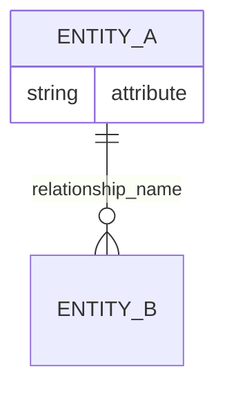

# Worldview Seeding - What's New

## Summary

Added ability to seed agents with initial domain knowledge using JSON or Mermaid files.

## Changes Made

### Core Functionality

**src/graph.ts**
- Added `seedPath` parameter to `load()` method
- Added `fromJSON()` method for loading JSON seeds
- Seeds are loaded only on first initialization (existing worldviews take precedence)

**src/index.ts**
- Added `seedPath` to `WorldviewConfig` interface
- Plugin passes seedPath to graph loader on initialization

### Documentation

**SEEDING.md** (NEW)
- Complete guide to worldview seeding
- JSON and Mermaid format documentation
- Best practices for creating custom seeds
- Domain-specific examples (healthcare, customer support, trading, etc.)
- Multi-agent consistency patterns

**README.md** (UPDATED)
- Added seeding section to Quick Start
- Added seedPath to Configuration documentation

**QUICKSTART.md** (UPDATED)
- Added seeding to setup instructions
- Added seeding to Core Concepts section

**CHANGELOG.md** (UPDATED)
- Added seeding feature to v0.1.0 release notes

### Example Seeds

**seeds/general-conversation.json**
- Basic conversational agent
- USER, AGENT, MESSAGE, INTENT, TOPIC, TASK, CONTEXT
- 8 entities, 9 relationships
- Good for: General purpose assistants, chatbots

**seeds/bio-manufacturing.json**
- Scientific/lab automation domain
- Includes: ORGANISM, PROCESS, MATERIAL, EQUIPMENT, EXPERIMENT, MEASUREMENT
- 16 entities, 19 relationships
- Good for: Scientific agents, lab automation, bio-manufacturing systems

**seeds/project-management.mermaid**
- Task tracking domain (Mermaid format example)
- PROJECT, TASK, MILESTONE, GOAL, DEPENDENCY, RESOURCE
- Good for: Project tracking, workflow assistants

**seeds/game-design.json**
- Interactive experience domain
- PLAYER, AGENT, NARRATIVE, CHOICE, CONSEQUENCE, MECHANIC, EMOTION
- 11 entities, 13 relationships
- Good for: Game NPCs, interactive storytelling

### Examples

**examples/seeded-agents.ts** (NEW)
- bioManufacturingAgent() - Using bio-manufacturing seed
- gameDesignAgent() - Using game design seed
- compareSeededVsUnseeded() - Shows the difference seeding makes
- customSeedExample() - Creating seeds programmatically
- inspectSeededWorldview() - Examining loaded seeds
- multiAgentSharedSeed() - Multiple agents with shared vocabulary

## Usage

### Basic Usage

```typescript
const worldview = createWorldviewPlugin({
  seedPath: './seeds/bio-manufacturing.json'
})
```

### JSON Seed Format

```json
{
  "entities": [
    {
      "id": "ENTITY_NAME",
      "type": "ENTITY_NAME",
      "attributes": {}
    }
  ],
  "relationships": [
    {
      "source": "ENTITY_A",
      "target": "ENTITY_B",
      "type": "relationship_name",
      "cardinality": "||--o{",
      "confidence": 1.0
    }
  ]
}
```

### Mermaid Seed Format



## Behavior

1. **First run**: Seed loaded → saved to `runtime/worldviews/{agentId}.mermaid`
2. **Subsequent runs**: Existing worldview loaded (seed ignored)
3. **Evolution**: Agent adds to seeded concepts, doesn't overwrite
4. **To reseed**: Delete `runtime/worldviews/{agentId}.mermaid` and restart

## Benefits

✓ **Immediate domain grounding** - Agent understands core concepts from day one
✓ **Faster evolution** - Refines existing concepts vs discovering from scratch
✓ **Consistent vocabulary** - All agents start with shared understanding
✓ **Domain focus** - Pre-defined entities guide attention

## File Count

- 1 comprehensive guide (SEEDING.md)
- 4 example seeds (2 JSON, 1 Mermaid, 1 game design)
- 1 example file (seeded-agents.ts with 6 examples)
- Updates to 4 existing docs (README, QUICKSTART, CHANGELOG, graph.ts, index.ts)

## Total Lines Added

- SEEDING.md: ~650 lines
- Seeds: ~220 lines
- Examples: ~280 lines
- Code changes: ~40 lines
- **Total: ~1,190 lines**

## Integration Path

For your bio-manufacturing work specifically, use:

```typescript
const worldview = createWorldviewPlugin({
  seedPath: './packages/plugin-worldview/seeds/bio-manufacturing.json',
  evolutionIntervalMs: 60000,
  autoApplyThreshold: 0.9
})
```

This gives your agent immediate understanding of:
- Organisms, processes, materials, equipment
- Experiments and measurements
- How they relate to each other

Then as it interacts, it learns specifics:
- Particular organisms you work with
- Specific processes you use
- Your equipment and protocols
- Your measurement types

The seed provides the structure, evolution fills in your specifics.
