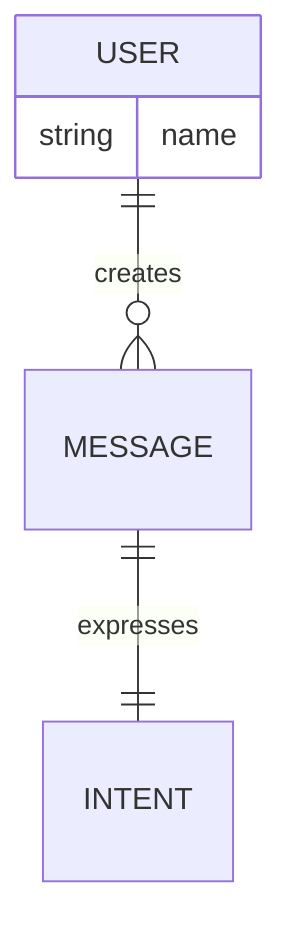

# Seeding Your Agent's Worldview

## Why Seed?

Rather than starting with an empty ontology, you can give your agent an initial understanding of its domain. This provides:

1. **Immediate semantic grounding** - Agent understands core concepts from day one
2. **Domain focus** - Pre-defined entities guide what the agent pays attention to
3. **Faster evolution** - Agent refines existing concepts rather than discovering everything
4. **Consistent vocabulary** - All agents in your system start with shared understanding

## Two Seed Formats

### JSON Format (Recommended)

More explicit and easier to edit:

```json
{
  "entities": [
    {
      "id": "USER",
      "type": "USER",
      "attributes": {
        "description": "Person interacting with agent"
      }
    },
    {
      "id": "MESSAGE",
      "type": "MESSAGE",
      "attributes": {}
    }
  ],
  "relationships": [
    {
      "source": "USER",
      "target": "MESSAGE",
      "type": "creates",
      "cardinality": "||--o{",
      "confidence": 1.0
    }
  ]
}
```

### Mermaid Format

More compact and visual:



## Using Seeds

### Option 1: Via Plugin Config

```typescript
const worldview = createWorldviewPlugin({
  seedPath: './seeds/bio-manufacturing.json'
})
```

### Option 2: Via Character File

```typescript
{
  "name": "BioAgent",
  "plugins": {
    "worldview": {
      "seedPath": "./seeds/bio-manufacturing.json"
    }
  }
}
```

### Option 3: Environment Variable

```bash
WORLDVIEW_SEED_PATH=./seeds/general-conversation.json
```

## Seed Behavior

1. **First run**: Seed is loaded → saved to `runtime/worldviews/{agentId}.mermaid`
2. **Subsequent runs**: Existing worldview is loaded (seed ignored)
3. **Evolution**: Agent adds to seeded concepts, doesn't overwrite them
4. **Observations increase**: Seeded relationships gain confidence as observed

## Provided Seeds

The plugin includes example seeds:

### `general-conversation.json`
Basic conversational agent with USER, MESSAGE, INTENT, TOPIC, TASK

**Use for:** General purpose assistants, chatbots, support agents

### `bio-manufacturing.json`
Extended ontology with ORGANISM, PROCESS, MATERIAL, EXPERIMENT, MEASUREMENT

**Use for:** Scientific agents, lab automation, bio-manufacturing systems

### `project-management.mermaid`
PROJECT, TASK, MILESTONE, GOAL, DEPENDENCY, RESOURCE

**Use for:** Project tracking agents, task managers, workflow assistants

## Creating Custom Seeds

### Start with Core Concepts

Identify the 5-10 most important entity types in your domain:

```typescript
// E-commerce example
entities: [
  "CUSTOMER",
  "PRODUCT", 
  "ORDER",
  "PAYMENT",
  "SHIPMENT"
]
```

### Define Key Relationships

Focus on structural relationships (not everything):

```json
{
  "source": "CUSTOMER",
  "target": "ORDER",
  "type": "places",
  "cardinality": "||--o{",  // Customer places many orders
  "confidence": 1.0
}
```

### Choose Meaningful Cardinality

Cardinality carries semantic weight:

- **`||--o{`** (OneToMany): Ownership, composition
  - USER ||--o{ MESSAGE (user owns their messages)
  - PROJECT ||--o{ TASK (project contains tasks)

- **`}o--o{`** (ManyToMany): Association, co-occurrence
  - MESSAGE }o--o{ TOPIC (messages discuss topics)
  - TASK }o--o{ RESOURCE (tasks require resources)

- **`||--||`** (OneToOne): Identity, strong binding
  - MESSAGE ||--|| INTENT (each message has one intent)
  - TASK ||--|| STATUS (each task has one status)

- **`}o--||`** (ManyToOne): Attribution, categorization
  - MESSAGE }o--|| CONVERSATION (messages belong to conversation)

## Domain-Specific Examples

### Healthcare Agent

```json
{
  "entities": [
    {"id": "PATIENT", "type": "PATIENT"},
    {"id": "SYMPTOM", "type": "SYMPTOM"},
    {"id": "DIAGNOSIS", "type": "DIAGNOSIS"},
    {"id": "TREATMENT", "type": "TREATMENT"},
    {"id": "MEDICATION", "type": "MEDICATION"}
  ],
  "relationships": [
    {
      "source": "PATIENT",
      "target": "SYMPTOM",
      "type": "reports",
      "cardinality": "||--o{"
    },
    {
      "source": "SYMPTOM",
      "target": "DIAGNOSIS",
      "type": "indicates",
      "cardinality": "}o--o{"
    },
    {
      "source": "DIAGNOSIS",
      "target": "TREATMENT",
      "type": "requires",
      "cardinality": "||--o{"
    },
    {
      "source": "TREATMENT",
      "target": "MEDICATION",
      "type": "includes",
      "cardinality": "}o--o{"
    }
  ]
}
```

### Customer Support Agent

```json
{
  "entities": [
    {"id": "CUSTOMER", "type": "CUSTOMER"},
    {"id": "TICKET", "type": "TICKET"},
    {"id": "ISSUE", "type": "ISSUE"},
    {"id": "SOLUTION", "type": "SOLUTION"},
    {"id": "PRODUCT", "type": "PRODUCT"}
  ],
  "relationships": [
    {
      "source": "CUSTOMER",
      "target": "TICKET",
      "type": "creates",
      "cardinality": "||--o{"
    },
    {
      "source": "TICKET",
      "target": "ISSUE",
      "type": "describes",
      "cardinality": "||--||"
    },
    {
      "source": "ISSUE",
      "target": "PRODUCT",
      "type": "relates_to",
      "cardinality": "}o--||"
    },
    {
      "source": "ISSUE",
      "target": "SOLUTION",
      "type": "resolved_by",
      "cardinality": "||--o|"
    }
  ]
}
```

### Trading Agent

```json
{
  "entities": [
    {"id": "ASSET", "type": "ASSET"},
    {"id": "MARKET", "type": "MARKET"},
    {"id": "SIGNAL", "type": "SIGNAL"},
    {"id": "TRADE", "type": "TRADE"},
    {"id": "POSITION", "type": "POSITION"},
    {"id": "RISK", "type": "RISK"}
  ],
  "relationships": [
    {
      "source": "ASSET",
      "target": "MARKET",
      "type": "traded_on",
      "cardinality": "}o--||"
    },
    {
      "source": "MARKET",
      "target": "SIGNAL",
      "type": "generates",
      "cardinality": "||--o{"
    },
    {
      "source": "SIGNAL",
      "target": "TRADE",
      "type": "triggers",
      "cardinality": "||--o|"
    },
    {
      "source": "TRADE",
      "target": "POSITION",
      "type": "modifies",
      "cardinality": "}o--||"
    },
    {
      "source": "POSITION",
      "target": "RISK",
      "type": "has",
      "cardinality": "||--||"
    }
  ]
}
```

## Best Practices

### 1. Start Small
Begin with 5-10 core entities. Let evolution add the rest.

### 2. Focus on Structure
Seed structural relationships (ownership, composition). Let the agent discover associations.

### 3. Use Consistent Naming
- UPPERCASE for entity types
- lowercase_with_underscores for relationship types
- Descriptive but concise

### 4. Set High Confidence
Seeded relationships should have `confidence: 1.0` - you're certain about them.

### 5. Add Attributes Sparingly
Only include attributes that are truly core to the entity's identity.

### 6. Think Hierarchically
Core entities → relationships → attributes (in that order of importance)

## Testing Your Seed

Create a test agent:

```typescript
import { createWorldviewPlugin } from '@eliza/plugin-worldview'

const worldview = createWorldviewPlugin({
  seedPath: './my-seed.json',
  evolutionIntervalMs: 10000  // Fast for testing
})

// Initialize agent
const runtime = new AgentRuntime({
  agentId: 'test-agent',
  plugins: [worldview]
})

await runtime.initialize()

// Check loaded worldview
const graph = worldview.getGraph()
console.log(graph.toMermaid())
console.log(graph.getStats())
```

## Updating Seeds

Seeds are only loaded on first initialization. To update:

1. Delete existing worldview: `rm runtime/worldviews/{agentId}.mermaid`
2. Update seed file
3. Restart agent

Or manually edit the worldview file directly.

## Seed Version Control

Track seeds in git:

```bash
seeds/
├── v1-basic.json
├── v2-extended.json
└── current.json -> v2-extended.json
```

This lets you:
- Version your ontologies
- A/B test different seeds
- Roll back if needed
- Share seeds across team

## Multi-Agent Consistency

For multi-agent systems, use the same seed:

```typescript
const sharedSeed = './seeds/company-domain.json'

const agents = [
  createAgent('support-agent', { seedPath: sharedSeed }),
  createAgent('sales-agent', { seedPath: sharedSeed }),
  createAgent('analyst-agent', { seedPath: sharedSeed })
]
```

All agents start with shared vocabulary, then specialize through their own interactions.

## Advanced: Partial Seeds

You can seed just entities or just relationships:

```json
{
  "entities": [
    {"id": "CUSTOM_ENTITY", "type": "CUSTOM_ENTITY"}
  ]
  // relationships will be learned
}
```

Or:

```json
{
  "relationships": [
    {
      "source": "USER",
      "target": "CUSTOM_ENTITY",
      "type": "uses",
      "cardinality": "||--o{"
    }
  ]
  // entities will be inferred from relationships
}
```

## Validation

The plugin validates seeds on load:

- Entities referenced in relationships must exist
- Cardinality must be valid enum value
- Confidence must be 0-1
- No circular self-references (unless intentional)

Invalid seeds will log errors but won't crash - they'll fall back to empty ontology.

## Examples Directory

Check `seeds/` directory for:
- `general-conversation.json` - Basic agent
- `bio-manufacturing.json` - Scientific domain
- `project-management.mermaid` - Task tracking

Use these as templates for your domain!
